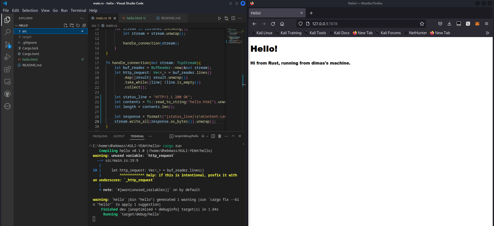

# Commit 1 Reflection notes
`let buf_reader = BufReader::new(&mut stream);`
Membuat buffer reader dari sebuah stream
`buf_reader.lines()`
Mereturn sebuah iterator dari lines pada buffer reader
`let http_request: Vec<_> = buf_reader.lines()`
`        .map(|result| result.unwrap())`
`        .take_while(|line| !line.is_empty())`
`        .collect();`
Membuat sebuah collection dari element-element hasil extract dari buf_reader dimana element tersebut bukan sebuah line kosong
`println!("Request: {:#?}", http_request);`
print http_request dengan format yang bagus

# Commit 2 Reflection notes
