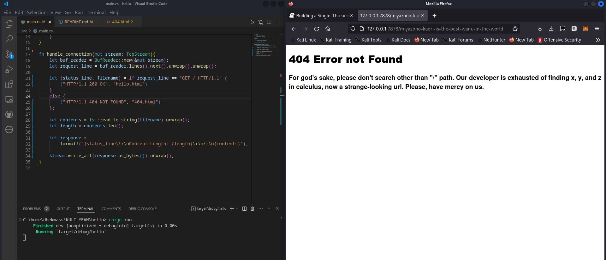

# Commit 1 Reflection notes
`let buf_reader = BufReader::new(&mut stream);`
Membuat buffer reader dari sebuah stream
<br/>

`buf_reader.lines()`
Mereturn sebuah iterator dari lines pada buffer reader
<br/>

`let http_request: Vec<_> = buf_reader.lines()`
`        .map(|result| result.unwrap())`
`        .take_while(|line| !line.is_empty())`
`        .collect();`
Membuat sebuah collection dari element-element hasil extract dari buf_reader dimana element tersebut bukan sebuah line kosong
<br/>

`println!("Request: {:#?}", http_request);`
print http_request dengan format yang bagus

# Commit 2 Reflection notes


# Commit 3 Reflection notes
Split response dilakukan oleh code `buf_reader.lines().next().unwrap().unwrap();`.<br/>
next() untuk mendapatkan item selanjutnya (pertama) dari `buf_reader.lines()`, yaitu Option<Result<String, Error>>.<br/>
Karena yang saya inginkan yaitu string dalam Result<String, Error>, maka lakukan unwrap() 2 kali.

Saya melakukan refactoring karena adanya duplicate code pada function `handle_connection()`. Duplicate core merupakan salah satu code smell yang harus dihilangkan. Solusi yang saya lakukan yaitu dengan menghapus code duplikat dan memanfaatkan status_line dan filename yang nilainya dinamis.

output 404.html (jika pathnya bukan "/")


# Commit 4 Reflection notes
Jika /sleep dibuka, maka akan ada jeda waktu 10 detik bagi browser untuk load. Hal ini bisa terjadi karena thread dipaksa untuk sleep selama 10 detik sedangkan server menggunakan single thread, sehingga tidak ada thread lain yang dapat memproses.

# Commit 5 Reflection notes
Thread pool adalah design pattern untuk menjalankan concurrency. Thread pool digunakan untuk memanage worker threads melalui code `workers: Vec<Worker>,`. Threads nantinya akan dieksekusi secara asynchronous sehingga dapat meningkatkan performa web-server. 
Tasks(jobs) dari main thread akan dikirimkan ke worker threads melalui `sender: mpsc::Sender<Job>`. 
<br/><br/>
Fungsi `new(size: usize) -> ThreadPool` pada ThreadPool berguna untuk membuat worker thread dalam thread pool.
`let (sender, receiver) = mpsc::channel();` membuat tuple sender dan receiver, dengan receiver digunakan oleh worker threads untuk mendapatkan tasks. `let receiver = Arc::new(Mutex::new(receiver));` berguna agar receiver bisa dihare antar worker threads.<br/>
```
let mut workers = Vec::with_capacity(size);

for id in 0..size{
    workers.push(Worker::new(id, Arc::clone(&receiver)));
}
```
berguna untuk membuat workers sebanyak `size` dan tiap worker dimasukkan ke vector `workers`. Terakhir fungsi `new` akan membuat instance `ThreadPool` dengan workers dan sender yang telah dibuat sebelumnya dan mereturn `ThreadPool` tersebut.
<br/><br/>
fungsi `execute` berguna untuk mengsubmit sebuah task ke thread pool agar dapat dieksekusi